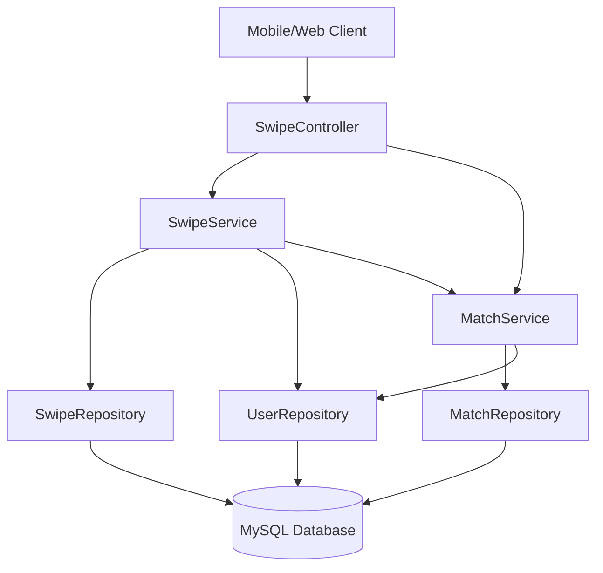

# Design Document - Swipe and Matching System

## Overview

The Swipe and Matching System implements a Tinder-like discovery mechanism for BrainBuddy, enabling users to find study partners through a swipe-based interface. The system leverages the existing User, Swipe, and Match entities while adding new service layers and API endpoints to handle the core matching logic.

The design follows Spring Boot best practices with a layered architecture: Controllers handle HTTP requests, Services contain business logic, and Repositories manage data persistence. The system ensures data consistency through proper transaction management and prevents duplicate matches through careful query design.

## Architecture

### High-Level Architecture



### Service Layer Design

**SwipeService**: Handles all swipe-related operations including:
- Finding potential matches for a user
- Recording swipe actions
- Triggering match creation logic

**MatchService**: Manages match-related operations including:
- Creating matches when mutual likes are detected
- Retrieving user's matches
- Preventing duplicate matches

## Components and Interfaces

### REST API Endpoints

#### SwipeController

```java
@RestController
@RequestMapping("/api/swipes")
public class SwipeController {
    
    // Get next potential match for user
    @GetMapping("/potential/{userId}")
    public ResponseEntity<UserProfileDTO> getNextPotentialMatch(@PathVariable Long userId)
    
    // Record a swipe action
    @PostMapping
    public ResponseEntity<SwipeResultDTO> recordSwipe(@RequestBody SwipeRequestDTO swipeRequest)
}
```

#### MatchController

```java
@RestController
@RequestMapping("/api/matches")
public class MatchController {
    
    // Get all matches for a user
    @GetMapping("/user/{userId}")
    public ResponseEntity<List<MatchDTO>> getUserMatches(@PathVariable Long userId)
}
```

### Service Interfaces

#### SwipeService

```java
public interface SwipeService {
    Optional<User> getNextPotentialMatch(Long userId);
    SwipeResult recordSwipe(Long swiperId, Long targetId, boolean liked);
    boolean hasUserSwipedOnTarget(Long swiperId, Long targetId);
}
```

#### MatchService

```java
public interface MatchService {
    Optional<Match> createMatchIfMutual(Long user1Id, Long user2Id);
    List<Match> getUserMatches(Long userId);
    boolean areUsersMatched(Long user1Id, Long user2Id);
}
```

## Data Models

### DTOs (Data Transfer Objects)

#### SwipeRequestDTO
```java
public class SwipeRequestDTO {
    private Long swiperId;
    private Long targetId;
    private boolean liked;
}
```

#### SwipeResultDTO
```java
public class SwipeResultDTO {
    private boolean success;
    private boolean isMatch;
    private UserProfileDTO nextPotentialMatch;
    private String message;
}
```

#### UserProfileDTO
```java
public class UserProfileDTO {
    private Long id;
    private String name;
    private String bio;
    // Additional profile fields as needed
}
```

#### MatchDTO
```java
public class MatchDTO {
    private Long matchId;
    private UserProfileDTO matchedUser;
    private LocalDateTime matchedAt;
}
```

### Repository Queries

#### SwipeRepository
```java
public interface SwipeRepository extends JpaRepository<Swipe, Long> {
    
    // Check if user has already swiped on target
    boolean existsBySwiper_IdAndTarget_Id(Long swiperId, Long targetId);
    
    // Find users that the current user has NOT swiped on
    @Query("SELECT u FROM User u WHERE u.id != :userId AND u.id NOT IN " +
           "(SELECT s.target.id FROM Swipe s WHERE s.swiper.id = :userId)")
    List<User> findPotentialMatches(@Param("userId") Long userId, Pageable pageable);
    
    // Check if target user has liked the swiper back
    Optional<Swipe> findBySwiper_IdAndTarget_IdAndLiked(Long swiperId, Long targetId, boolean liked);
}
```

#### MatchRepository
```java
public interface MatchRepository extends JpaRepository<Match, Long> {
    
    // Find all matches for a user (where user is either user1 or user2)
    @Query("SELECT m FROM Match m WHERE m.user1.id = :userId OR m.user2.id = :userId ORDER BY m.id DESC")
    List<Match> findMatchesByUserId(@Param("userId") Long userId);
    
    // Check if two users are already matched
    boolean existsByUser1_IdAndUser2_IdOrUser1_IdAndUser2_Id(
        Long user1Id, Long user2Id, Long user2Id2, Long user1Id2);
}
```

## Error Handling

### Exception Types

1. **UserNotFoundException**: When a user ID doesn't exist
2. **DuplicateSwipeException**: When attempting to swipe on the same user twice
3. **InvalidSwipeException**: When swipe data is malformed
4. **DatabaseException**: For database connectivity issues

### Error Response Format

```java
public class ErrorResponse {
    private String error;
    private String message;
    private int status;
    private LocalDateTime timestamp;
}
```

### Global Exception Handler

```java
@ControllerAdvice
public class SwipeExceptionHandler {
    
    @ExceptionHandler(UserNotFoundException.class)
    public ResponseEntity<ErrorResponse> handleUserNotFound(UserNotFoundException ex);
    
    @ExceptionHandler(DuplicateSwipeException.class)
    public ResponseEntity<ErrorResponse> handleDuplicateSwipe(DuplicateSwipeException ex);
    
    // Additional exception handlers...
}
```

## Testing Strategy

### Unit Testing

**Service Layer Tests:**
- Test SwipeService methods with mocked repositories
- Test MatchService logic for mutual match detection
- Test edge cases like no potential matches available
- Test concurrent swipe scenarios

**Repository Layer Tests:**
- Test custom queries with @DataJpaTest
- Verify query performance with large datasets
- Test constraint violations and database exceptions

### Integration Testing

**Controller Tests:**
- Test complete API workflows with @SpringBootTest
- Test request/response mapping with MockMvc
- Test authentication and authorization (when implemented)

**Database Integration:**
- Test with embedded H2 database for CI/CD
- Test transaction rollback scenarios
- Test concurrent access patterns

### Test Data Setup

```java
@TestConfiguration
public class SwipeTestDataConfig {
    
    @Bean
    @Primary
    public SwipeService mockSwipeService() {
        return Mockito.mock(SwipeService.class);
    }
    
    // Test data builders for consistent test setup
    public static User createTestUser(String name, String email) { ... }
    public static Swipe createTestSwipe(User swiper, User target, boolean liked) { ... }
}
```

### Performance Considerations

1. **Database Indexing**: Add indexes on frequently queried columns (swiper_id, target_id, user1_id, user2_id)
2. **Query Optimization**: Use pagination for potential matches to avoid loading large result sets
3. **Caching**: Consider caching user profiles for frequently accessed data
4. **Connection Pooling**: Ensure proper database connection pool configuration for concurrent users

### Security Considerations

1. **Input Validation**: Validate all user inputs to prevent injection attacks
2. **Authorization**: Ensure users can only swipe as themselves and view their own matches
3. **Rate Limiting**: Implement rate limiting to prevent spam swiping
4. **Data Privacy**: Ensure user data is properly protected and not exposed in error messages